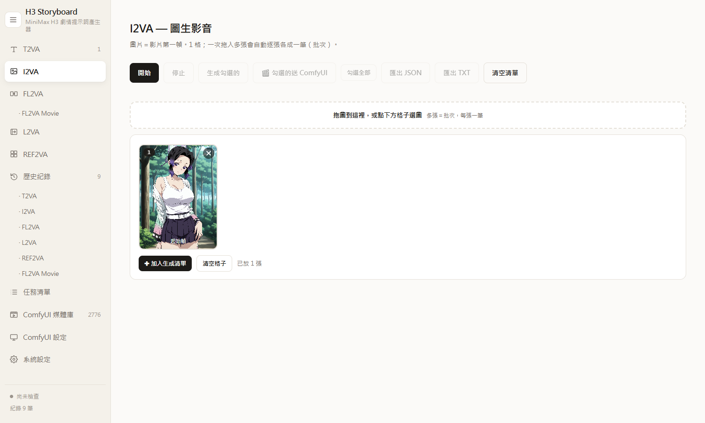
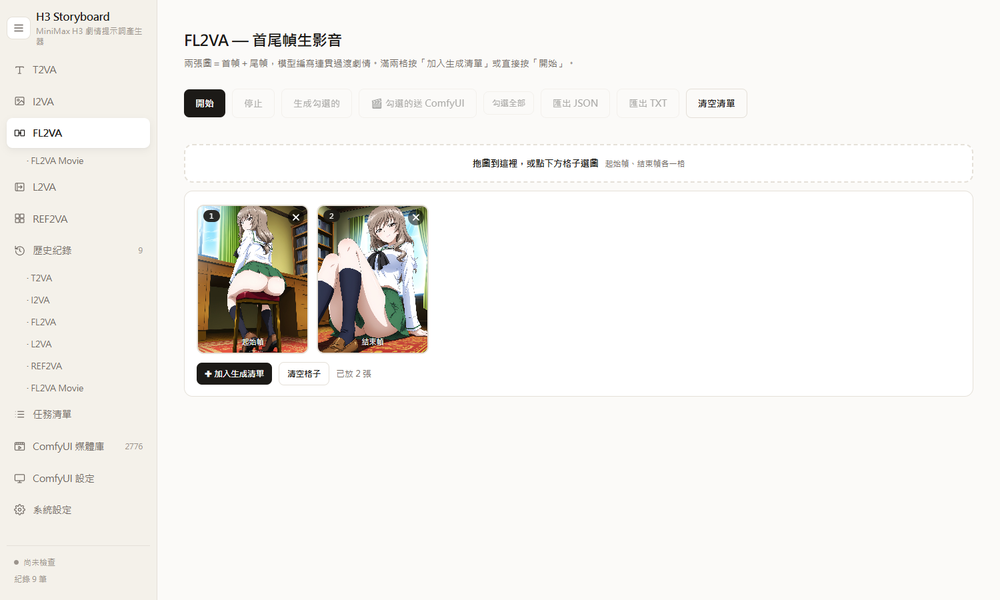
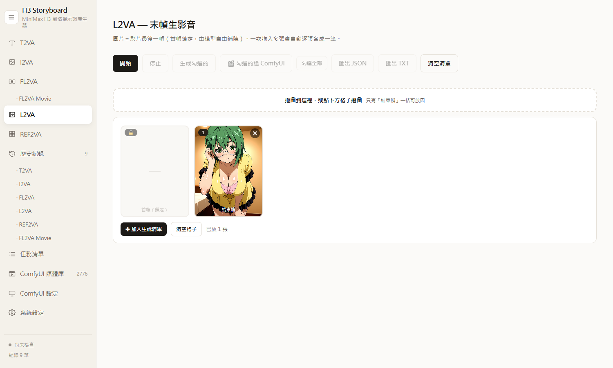
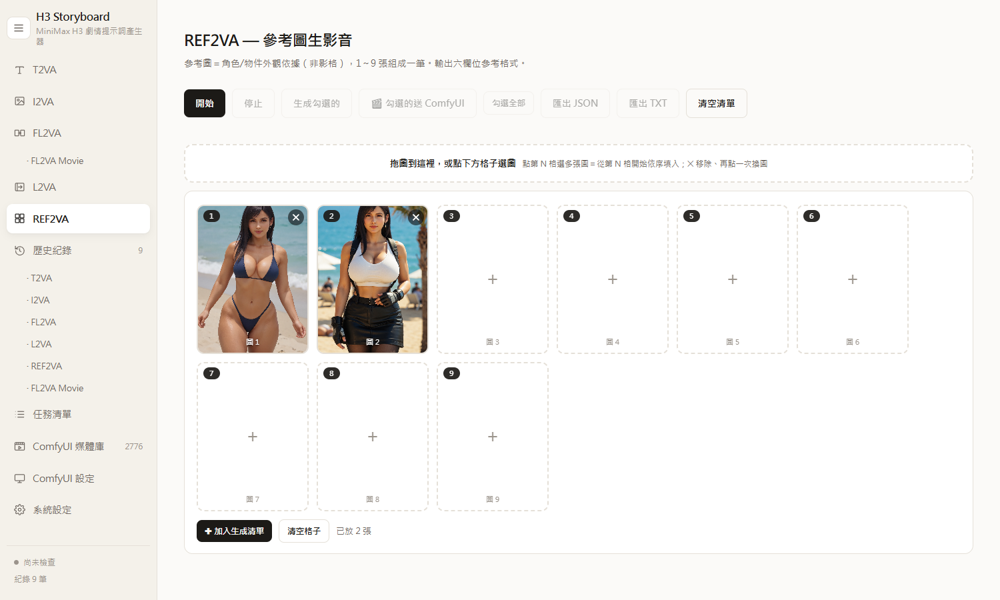
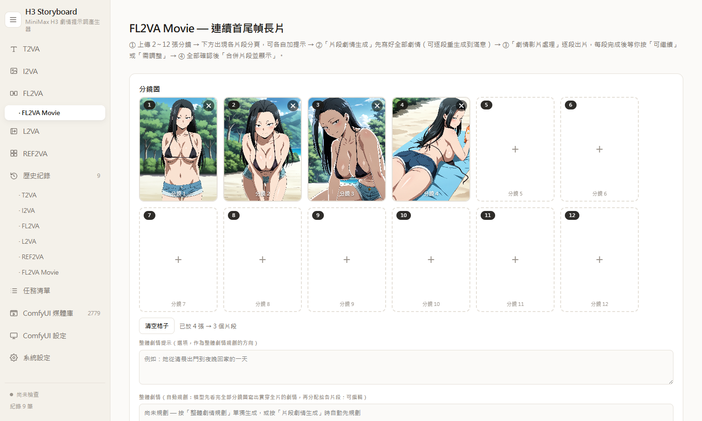
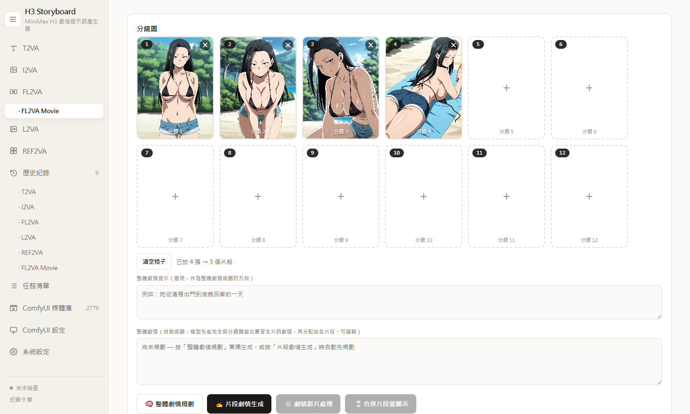
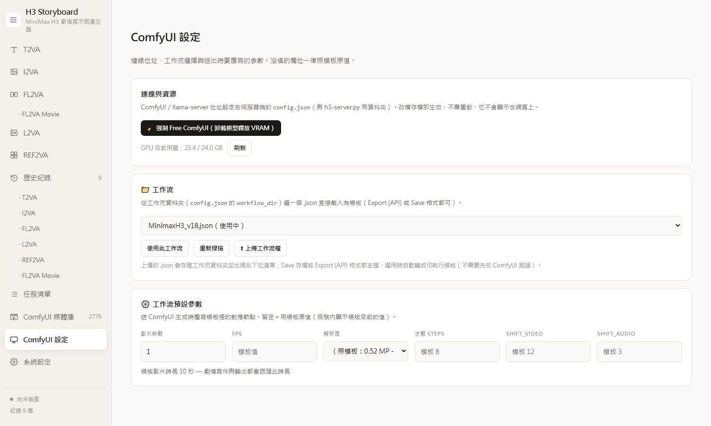
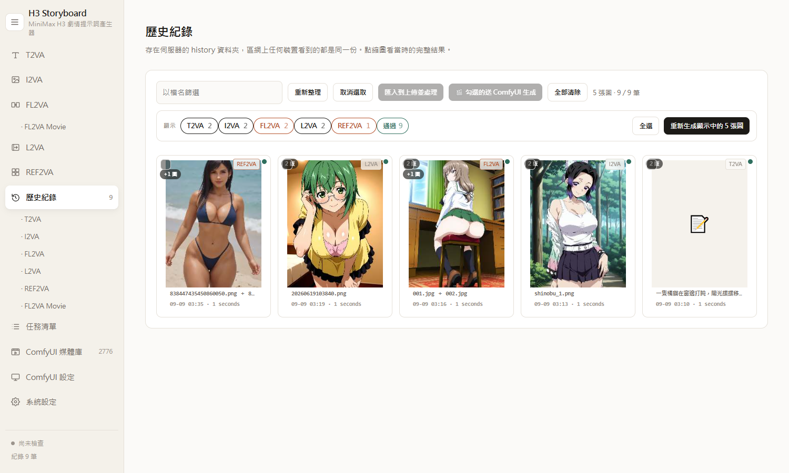
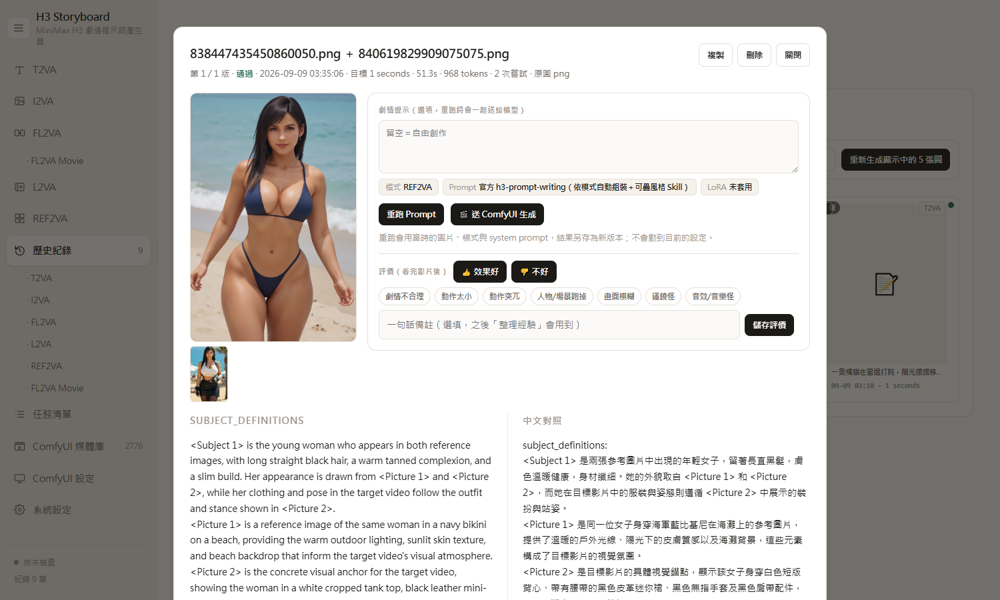
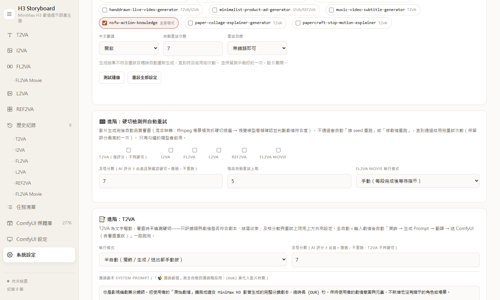

# H3 Storyboard — Image-to-Video Story Prompt WebUI + ComfyUI Pipeline

Turn images into complete MiniMax H3 (Hailuo) video+audio prompts with your own local llama-server (multimodal Qwen model), then send them straight to ComfyUI and get finished videos — including chained multi-segment long films with automatic quality review.  
用本地 llama-server（多模態 Qwen 模型）把圖片變成完整的 MiniMax H3（Hailuo）影音 Prompt，並可直接送 ComfyUI 產出成品影片——包含多段接龍長片與自動品質審查。

This project is fully open source — copy, modify and use it freely (MIT License).  
本專案完全開源——可任意複製、修改與使用（MIT 授權）。

---

## Four task modes 四種任務模式

Each mode has its own slot grid, its own generation list and its own history — switching modes never mixes them up.  
每個模式都有獨立的格子、生成清單與歷史紀錄——切換模式互不干擾。

### I2VA — image = first frame 圖生影音

The image is the FIRST frame; the story evolves forward from it. Drop multiple images at once to build a batch (one item per image).  
圖片＝影片第一幀，劇情從這張圖向後展開；一次拖入多張會自動逐張各成一筆（批次）。

### FL2VA — first + last frame 首尾幀生影音

Two images are the first and last frames; the model writes one continuous, logical transition between them.  
兩張圖＝首幀＋尾幀，模型編寫一段連貫合理的過渡劇情。

### L2VA — image = last frame 末幀生影音

The image is the LAST frame; the first frame is unconstrained (locked slot), and the story builds up and concludes exactly at your image.  
圖片＝影片最後一幀；首幀鎖定不放圖（由模型自由鋪陳），劇情精準收束在你的圖上。

### REF2VA — reference images 參考圖生影音

1 to 9 reference images define character/object appearance (not frames); outputs the six-section reference format with `<Subject N>` / `<Picture N>` tokens, per-subject retention levels, and explicit on-screen/off-screen declarations per shot.
1～9 張參考圖作為角色/物件外觀依據（非影格），輸出六欄位參考格式：`<Subject N>`／`<Picture N>` 代號、每個主體的保留等級、每個 Shot 明確宣告誰入鏡誰不入鏡。

Slots support drag-to-reorder, click-to-replace and per-slot remove.  
格子支援拖曳換順序、再點一次換圖、單格移除。

---

## FL2VA Movie — chained long film 連續首尾幀長片

Upload 2–12 storyboard images and get one continuous long video: N images become N-1 segments, and each new segment starts from the ACTUAL rendered last frame of the previous one, so motion never jumps between segments.  
上傳 2～12 張分鏡圖產出一支連續長片：N 張圖＝N−1 個片段，且每個新片段用前一段「實際算圖輸出的最後一幀」當首幀，段落銜接不跳動。

Story planning happens film-first: the model reads ALL storyboard images in order, writes one overall plot, then assigns each segment its own beat and dialogue plan — so segments stay coherent instead of feeling like unrelated clips.  
劇情採「先總後分」：模型先依序看完全部分鏡圖寫出貫穿全片的整體劇情，再分配各片段的任務與對話——片段之間連貫，不會各演各的。

The four-stage flow keeps you in control: ① plan the whole story → ② generate every segment's prompt (regenerate any segment until satisfied) → ③ render segment videos one by one, confirming 可繼續 / 需調整 after each — or let full-auto mode run the whole chain — → ④ merge all segments into the final film.  
四階段流程全程可控：① 整體劇情規劃 → ② 片段劇情生成（可逐段重生成到滿意）→ ③ 劇情影片處理逐段出片，每段確認「可繼續／需調整」——也可切完全自動化一路跑完——→ ④ 合併片段並顯示成品。

Movie projects are saved server-side with their own history category — reopen any project later to review or continue it.
Movie 專案存在伺服器端，有專屬歷史分類——之後可隨時開回來查看或續作。

---

## Story quality guarantees 劇情品質保證

- Output follows the official MiniMax H3 prompt structure, with `overall_soundscape` and `non_diegetic_music` sections.  
  輸出遵循 MiniMax H3 官方 Prompt 結構，含整體聲景與配樂欄位。
- Dialogue uses the H3 syntax `(S1) says: <d>[Japanese] ...</d>`, every line followed by a lip-sync sentence; at least 2 meaningful dialogue lines (no filler sounds).  
  對話使用 H3 語法 `(S1) says: <d>[Japanese] ...</d>`，每句後附唇形同步句；至少 2 句有內容的台詞（禁止語助詞充數）。
- Story length follows the applied ComfyUI workflow duration (e.g. a 10-second workflow gets a 10-second story), scaled at ~15 words per second, written as one continuous take with smooth camera moves and no hard cuts.  
  劇情長度跟隨套用的 ComfyUI 工作流秒數（10 秒工作流就寫 10 秒劇情），依每秒約 15 個英文單詞縮放；一鏡到底、平滑運鏡、禁止硬切。
- Physical-continuity rules prevent common artifacts: no teleporting motion, no "suddenly" limb movements, a deliberate action-beat budget per video.  
  物理連續性規則防止常見破圖：禁止瞬移、禁止用「suddenly」帶過肢體動作、動作節拍數量受控。
- High randomness: the same image (even the same hint) produces a different story every run.  
  高隨機性：同一張圖（甚至同一個提示）每次生成的劇情都不同。
- Every mode accepts an optional story hint in any language; a built-in validator checks the format and auto-retries failed generations.  
  每個模式都可選填任何語言的劇情提示；內建格式檢核，不達標自動重生成。

---

## ComfyUI integration ComfyUI 整合

Pick any workflow .json from your workflow folder (or upload one from the page) and it becomes the template directly — both Save format and Export (API) format are supported, converted server-side without ever needing a prior run in ComfyUI.  
從工作流資料夾選任一 .json（或直接從網頁上傳）即可成為模板——Save 存檔與 Export (API) 格式都支援，由伺服器端直接轉換，完全不需要先在 ComfyUI 跑過一次。

- One click sends a generated prompt (with its images) into the Director-based workflow; the Director mode switches automatically to match the sidebar mode (I2VA/FL2VA/L2VA/REF2VA).  
  一鍵把生成好的 Prompt（連同圖片）送進 Director 工作流；Director 模式會自動跟著側欄模式切換。
- Default parameters (fps, resolution, steps, shift...) can be overridden per send; empty fields keep the template's own values.  
  預設參數（fps／解析度／步數／shift…）可逐項覆寫；留空一律照模板原值。
- Finished videos embed the full workflow metadata, so dragging a video back into ComfyUI restores the exact graph and prompt.  
  成品影片內嵌完整工作流參數，拖回 ComfyUI 即還原當時的節點圖與 Prompt。
- A media library page browses everything in the ComfyUI output folder.  
  媒體庫頁可瀏覽 ComfyUI 輸出資料夾的所有成品。

### GPU coexistence GPU 共存協調

llama-server and ComfyUI can share one GPU: before prompting, the app frees ComfyUI's VRAM and waits for it to drop; before rendering, it waits for llama's idle unload — verified via nvidia-smi, fully automatic.
llama-server 與 ComfyUI 可共用一張 GPU：生成 Prompt 前自動 Free ComfyUI 並等 VRAM 降下，送算圖前等 llama 閒置卸載——透過 nvidia-smi 驗證，全自動。

---

## History + automatic video review 歷史紀錄＋自動影片審查

Every generation is stored server-side (with its images) and shared across devices on your LAN; filter by filename or mode, rerun any record with its original images, or resend it to ComfyUI.  
每筆生成（含圖片）存在伺服器端，區網任何裝置看到同一份；可依檔名／模式篩選，任一筆可用原圖重跑 Prompt 或重送 ComfyUI。

After a video renders, an optional quality review kicks in: ffmpeg scene detection proposes hard-cut candidates, a vision model watches extracted frames to confirm cuts and judge story match, ending settlement and overall quality with a 0–10 score. Failed videos automatically reroll the seed or revise the story and retry, keeping the best-scoring attempt.  
影片算完後可自動品質審查：ffmpeg 場景偵測抓硬切候選，視覺模型看抽幀確認硬切、判斷劇情符合度與結尾收束並給 0–10 分。不通過會自動「換 seed 重跑」或「修劇情重跑」，保留評分最高的一次。

The verdict (score, reasons, problems) is saved on the record and shown in the detail view; thumb-up/down feedback and tags feed the experience library.  
審查結果（分數、依據、問題點）會存進紀錄並顯示在詳情頁；👍👎 評價與標籤會累積進經驗庫。

Review is configurable per mode (checkboxes), with an adjustable pass score, retry cap, and a separate editable review system prompt (independent from the generation prompt).  
審查可逐模式勾選啟用，及格分數與重試上限可調，且有獨立可編輯的「評分審查 system prompt」（與生成用 prompt 分開）。

---

## Experience library 經驗庫

Your ratings and notes accumulate into reusable rules: one click asks the model to distill all pending feedback into general rules, you approve them, and every later generation injects the approved rules (global or per-mode). Hard gates (minimum word count, dialogue language, per-line word limits) are always applied.  
你的評價與備註會累積成可重用的規則：一鍵讓模型把待整理回饋歸納成通用規則，審核後入庫，之後每次生成自動注入（通用或指定模式）。結構門檻（字數下限、對白語言、單句字數）永遠套用。

---

## Getting started 快速開始

1. Run [llama.cpp](https://github.com/ggml-org/llama.cpp) `llama-server` with a multimodal Qwen model (tested with a 27B Q4_K_M build) and the OpenAI-compatible API enabled.  
   在任一台機器用 [llama.cpp](https://github.com/ggml-org/llama.cpp) `llama-server` 載入多模態 Qwen 模型（測試使用 27B Q4_K_M），開啟 OpenAI 相容 API。
2. (Optional) Run ComfyUI with the MiniMax H3 Director custom nodes if you want in-page video generation.  
   （選用）若要網頁內直接出片，另跑一個裝了 MiniMax H3 Director 自訂節點的 ComfyUI。
3. Double-click `start_app.bat` — it creates a dedicated Python venv on first run and opens `http://localhost:9998/`.  
   雙擊 `start_app.bat`——首次執行會自動建立專屬 Python venv，並開啟 `http://localhost:9998/`。
4. Fill in your llama-server / ComfyUI addresses and the workflow folder in the settings pages (saved to `config.json`).  
   在設定頁填入 llama-server／ComfyUI 位址與工作流資料夾（保存於 `config.json`）。
5. Pick a mode, upload image(s), optionally type a story hint, then generate — and send to ComfyUI when you like the prompt.  
   選擇模式 → 上傳圖片 →（選填）劇情提示 → 生成——滿意就一鍵送 ComfyUI。

Requirements: Windows + Python 3 and a modern browser; ffmpeg is auto-discovered (bundled imageio-ffmpeg works) for the review and merge features.  
需求：Windows＋Python 3 與現代瀏覽器；審查與合併功能會自動尋找 ffmpeg（imageio-ffmpeg 內附版即可）。

---

## Files 檔案說明

| File 檔案 | Purpose 用途 |
|---|---|
| `h3-webui.html` | The whole WebUI in one HTML file. 網頁介面（單一 HTML 檔）。 |
| `h3-server.py` | Backend: llama proxy, history, ComfyUI submit, GPU coordination, review scan, movie merge. 後端：llama 代理、歷史、ComfyUI 送單、GPU 協調、審查掃描、長片合併。 |
| `ui2api.py` | Converts ComfyUI Save-format workflows into runnable API graphs (subgraphs/bypass supported). 將 ComfyUI Save 格式工作流轉成可執行 API 圖（支援子圖／bypass）。 |
| `start_app.bat` | One-click launcher on port 9998. 一鍵啟動（port 9998）。 |
| `i2va_test.py` | The master System Prompt + a batch test harness. System Prompt 主版本＋批次測試腳本。 |
| `sync_prompt.py` | Syncs the System Prompt into the legacy `app.html`. 同步 System Prompt 至舊版 `app.html`。 |
| `app.html` | Legacy single-page frontend (kept for reference). 舊版簡易前端（保留參考）。 |

---

## License 授權

MIT License — free to copy, modify, distribute and use for any purpose.
MIT 授權——可為任何目的自由複製、修改、散布與使用。
